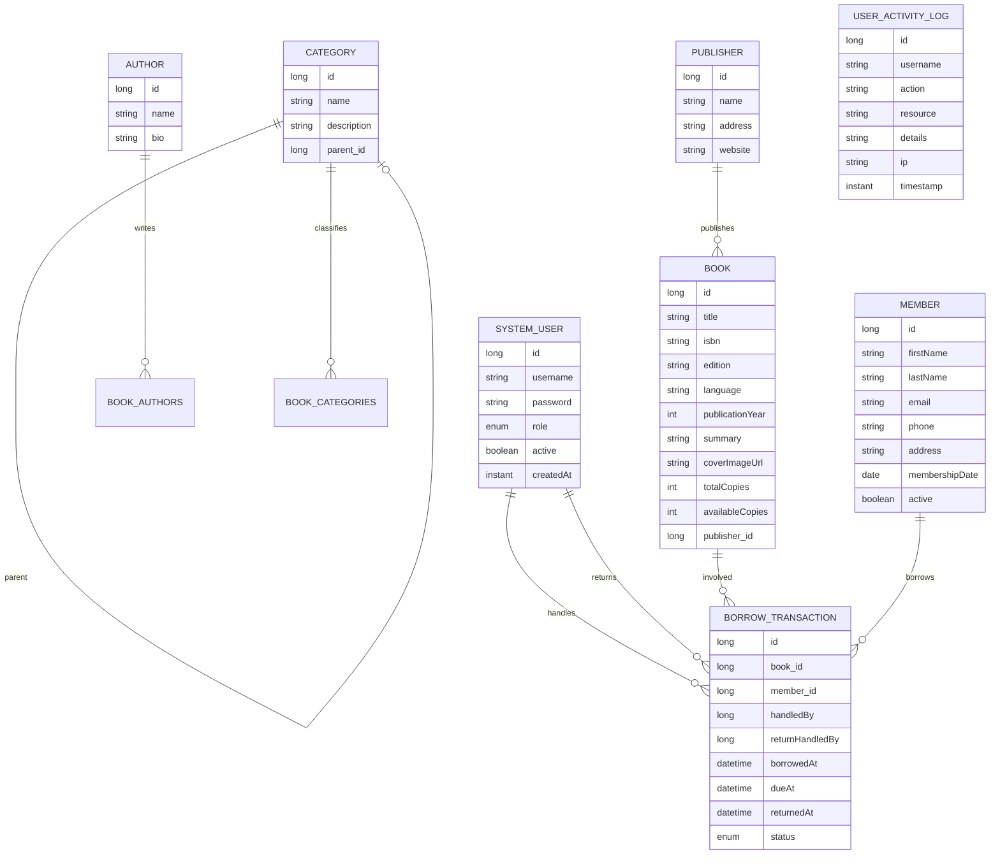

```mermaid
erDiagram
    SYSTEM_USER ||--o{ BORROW_TRANSACTION : handles
    SYSTEM_USER ||--o{ BORROW_TRANSACTION : returns

    SYSTEM_USER {
      long id
      string username
      string password
      enum role
      boolean active
      instant createdAt
    }

    AUTHOR ||--o{ BOOK_AUTHORS : writes
    CATEGORY ||--o{ BOOK_CATEGORIES : classifies
    PUBLISHER ||--o{ BOOK : publishes
    BOOK ||--o{ BORROW_TRANSACTION : involved
    MEMBER ||--o{ BORROW_TRANSACTION : borrows
    CATEGORY ||--o| CATEGORY : parent

    AUTHOR {
      long id
      string name
      string bio
    }
    PUBLISHER {
      long id
      string name
      string address
      string website
    }
    CATEGORY {
      long id
      string name
      string description
      long parent_id
    }
    BOOK {
      long id
      string title
      string isbn
      string edition
      string language
      int publicationYear
      string summary
      string coverImageUrl
      int totalCopies
      int availableCopies
      long publisher_id
    }
    MEMBER {
      long id
      string firstName
      string lastName
      string email
      string phone
      string address
      date membershipDate
      boolean active
    }
    BORROW_TRANSACTION {
      long id
      long book_id
      long member_id
      long handledBy
      long returnHandledBy
      datetime borrowedAt
      datetime dueAt
      datetime returnedAt
      enum status
    }

    USER_ACTIVITY_LOG {
      long id
      string username
      string action
      string resource
      string details
      string ip
      instant timestamp
    }
```
